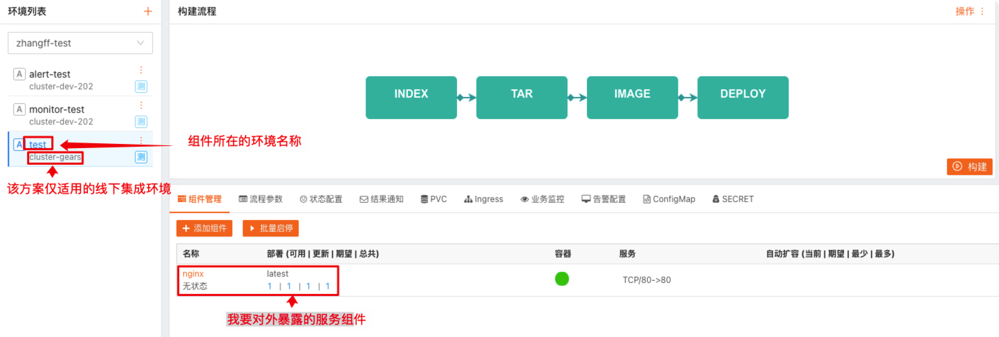
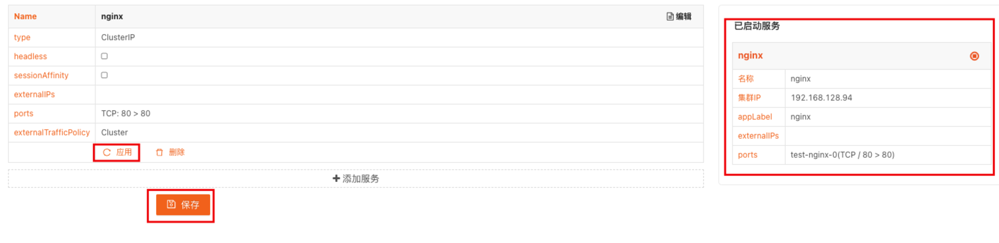

## 解决方案
通过创建一个内部DNS服务，将kubernetes集群内部服务映射到内部域名，从而实现快速访问。
## 优势
1. 不需要额外操作service注解
2. 不需要在本地修改hosts文件或进行局域网内域名解析
## 适用范围
1. TCP, UDP等四层协议服务（mysql, redis, rtmp...）
2. HTTP, HTTP2, gRPC等七层协议的服务
## 不适用范围
1. 程序外置HTTPS证书（通过ingress等进行证书挂载）

## 实现方式
开启kube-system coredns对外访问，添加如下Service Done
```kind: Service
apiVersion: v1
metadata:
  name: coredns-out
  namespace: kube-system
  labels:
    addonmanager.kubernetes.io/mode: Reconcile
    k8s-app: kube-dns
    kubernetes.io/cluster-service: 'true'
    kubernetes.io/name: coredns
  annotations:
    kubesphere.io/creator: admin
    prometheus.io/port: '9153'
    prometheus.io/scrape: 'true'
spec:
  ports:
    - name: dns
      protocol: UDP
      port: 53
      targetPort: 53
    - name: dns-tcp
      protocol: TCP
      port: 53
      targetPort: 53
    - name: metrics
      protocol: TCP
      port: 9153
      targetPort: 9153
  selector:
    k8s-app: kube-dns
  clusterIPs:
    - 192.168.139.253
  type: ClusterIP
  externalIPs:
    - 172.30.176.3
  ```

* 出口路由中中添加到kubernetes集群SVC网络的静态路由规则 
`ip route add -net 192.168.128.0/20 gw 172.30.176.3`
* ROS中添加一条域名解析转发规则
```/ip dns static
 add regexp=”.*\\.svc.\\.cluster\\.local” forward-to=172.30.176.3
 ```
 
* 做完以上步骤便可以直接通过“$svc_name.$namespace.svc.cluster.local”直接访问到集群中的服务。

## 操作方法
确定组件的所属集群为“cluster-gears”，该方案仅在此集成测试集群中可用。


1. 根据图示，补充相关信息
  1. Name = 组件名称
  2. Type = ClusterIP
  3. IP = 空
  4. 服务端口
  5. 容器端口
  6. 其余默认


1. 单击保存--->应用，确认右侧“已启动服务”

## 访问方式

最终服务访问方式：
$service_name.$namespace. svc.cluster.local:${service_port}
$service_name: service名称
$namespace: 环境名称
备注：动态域名，集群内（容器间）访问可省略. svc.cluster.local后缀，集群外（公司内网）访问必须完整域名。

如该示例项目最终访问方式即为：
http://nginx.test.svc.cluster.local:80

