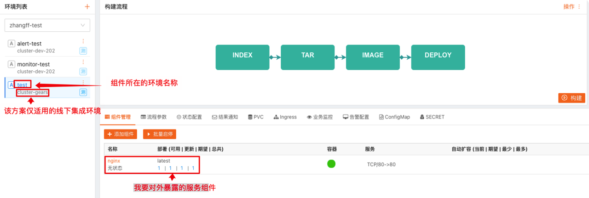
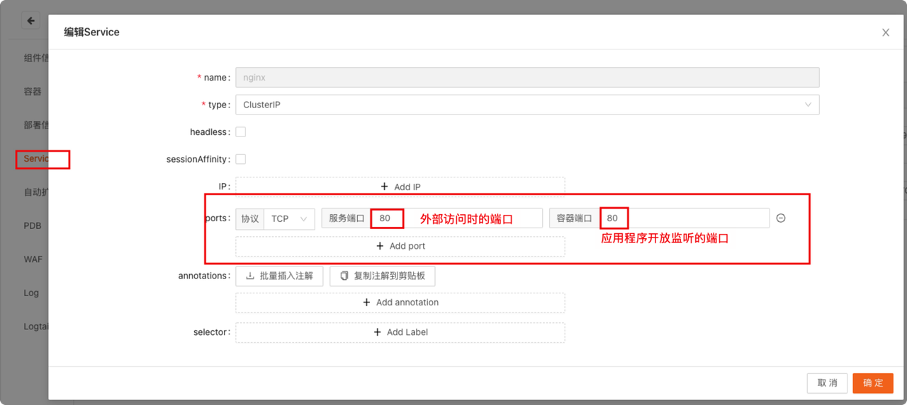
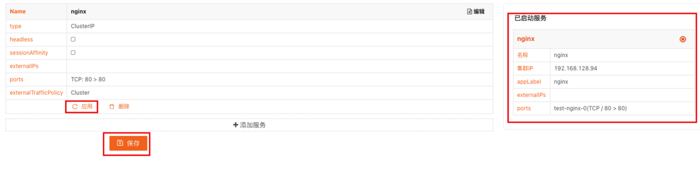

如何在内网环境下快速访问自己的服务？

为了提高交付效能，提升集成测试环境网络稳定性，方便产研同学快速测试和上线程序。我们优化了集成测试环境的服务暴露和访问方式。使用中有任何问题请联系IT运维部—>平台组。

**优势**  
* 不需要额外操作service注解;
* 不需要在本地修改hosts文件或进行局域网内域名解析;
  
**适用范围**  
* TCP, UDP等四层协议服务（mysql, redis, rtmp…）;
* HTTP, HTTP2, gRPC等七层协议的服务;

**不适用范围**  
* 程序外置HTTPS证书（通过ingress等进行证书挂载）;

**操作方法**  
* 确定组件的所属集群为“cluster-gears”，该方案仅在此集成测试集群中可用;

根据图示，补充相关信息
- Name = 组件名称
- Type = ClusterIP
- IP = 空
- 服务端口（外部访问的端口）
- 容器端口（应用程序开发的监听端口）
- 其余默认

1. 2. 单击保存—>应用，确认右侧“已启动服务”

访问方式
最终服务访问方式：
$service_name.$namespace.svc.cluster.local
$service_name: service名称
$namespace: 环境名称
备注：动态域名，集群内（容器间）访问可省略.svc.cluster.local后缀，集群外（公司内网）访问必须完整域名。
例如：
如该示例项目最终访问方式即为：
http://nginx.test.svc.cluster.local