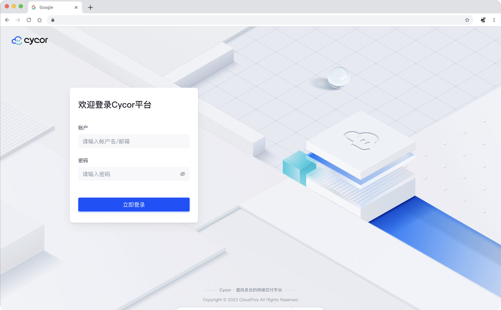
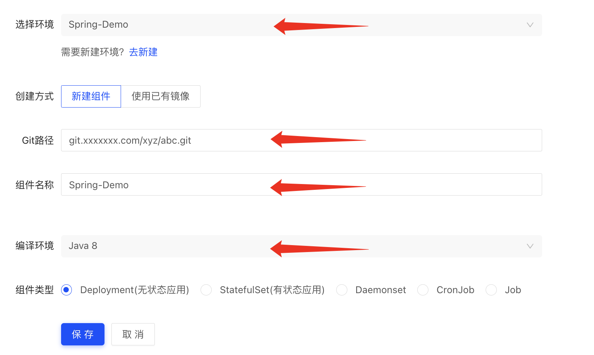
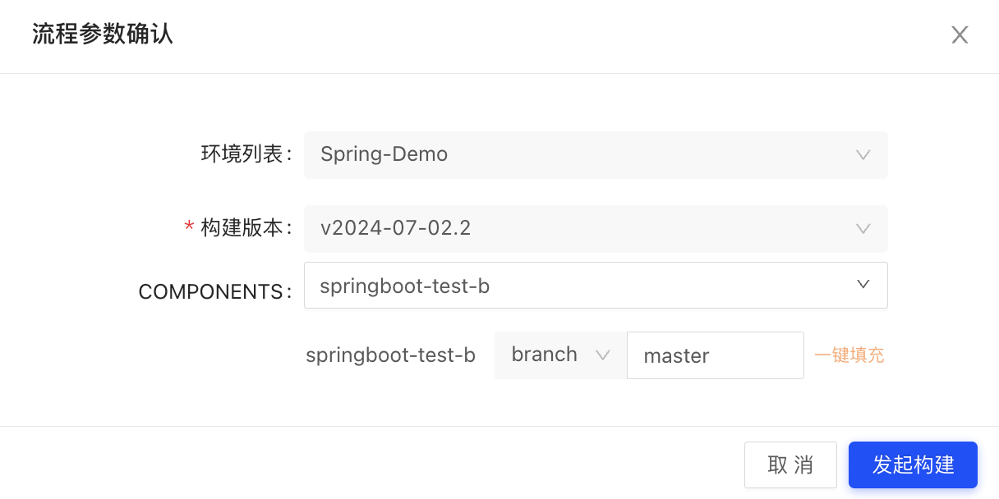

# 五分钟快速使用
### 简介
&nbsp;&nbsp;&nbsp;&nbsp;&nbsp;&nbsp;&nbsp;&nbsp;Cycor是一个智能化多云管理品牌，旗下有多个解决方案组成，将包括Cycor DevOps、Cycor FinOps(建设中)、Cycor Cloud多云管理平台(建设中)组成产品矩阵。而Cycor DevOps是一款专为多云环境设计的云原生持续交付和服务管理产品，具有高效的持续交付能力、高度灵活性等特点。

### 快速开始
访问和登录https://devops.cycor.io

### 创建你的第一个项目
路径：项目管理 ---> 添加项目

### 创建一个服务
路径：服务管理 ---> 组件 ---> 创建组件

* 按照实际情况选择自己的"环境名称";
* 填写自己项目的Git路径；
* 给你的组件起一个易懂的名字；
* 根据实际是需求，选择你的编译环境；
* 点击保存按钮，并返回到上一级菜单；

### 创建一个发布
路径：发布管理 ---> 发布 ---> 版本发布

* 新建或者选择一个版本；
* 选择你刚刚创建的组件；
* 点击“发起构建”按钮；
* 查看发布进度；

### 查看和访问你的服务
路径：服务管理 ---> 组件 ---> 服务列表

* 查看你的服务列表，确认服务状态运行正常；
* 内部链接为服务之间互相访问使用的访问链接，也可以在内网环境中直接进行访问；
* 外部链接为服务对外访问使用的访问链接，可以通过公网访问；