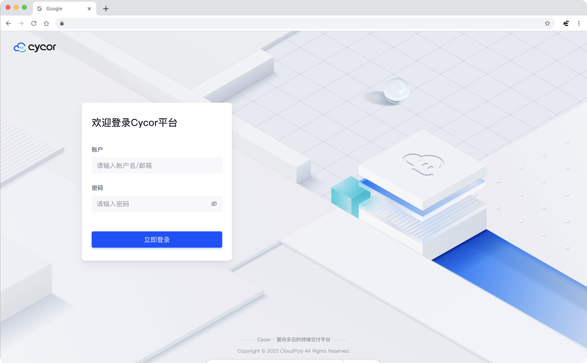
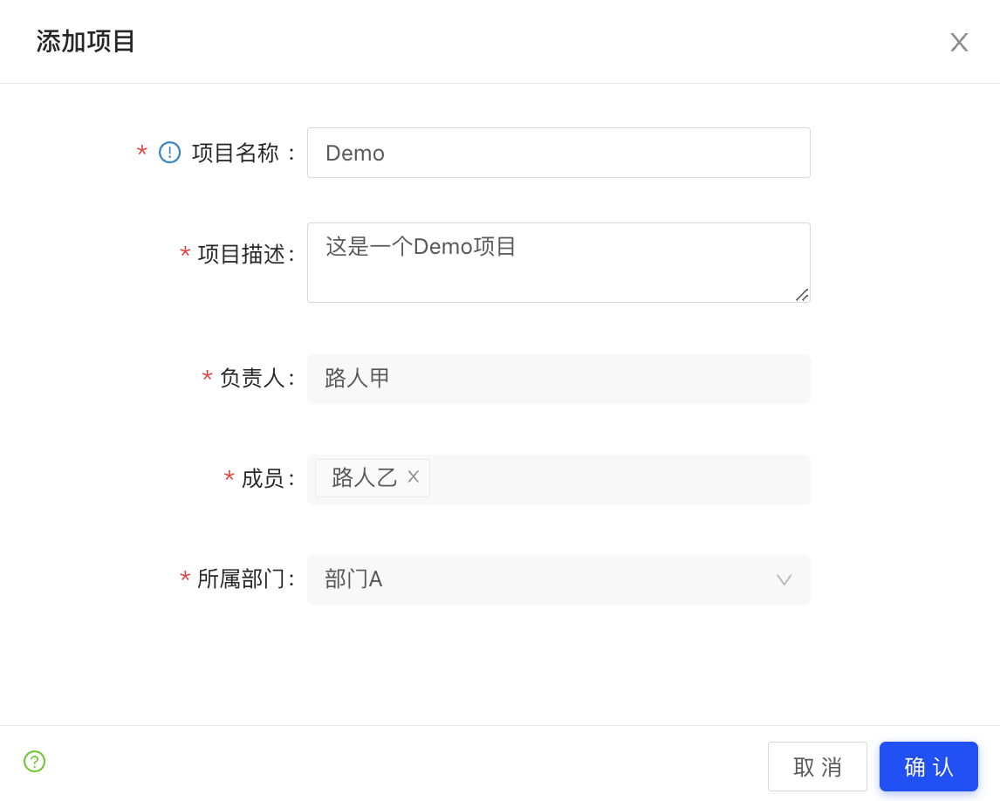
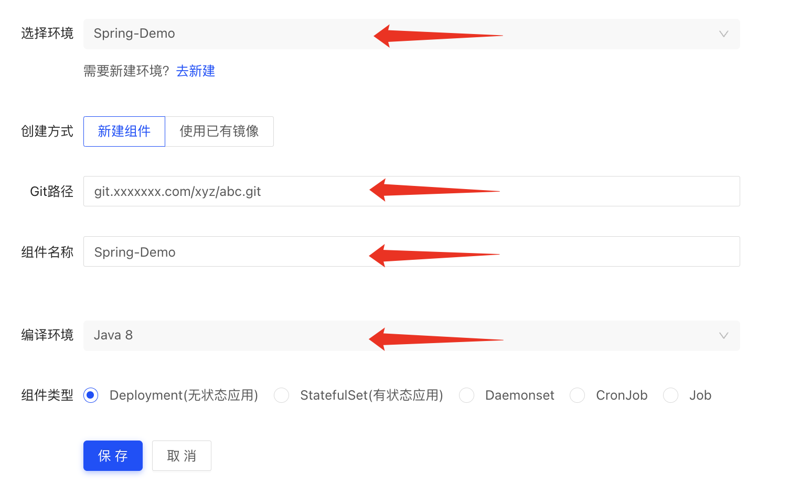
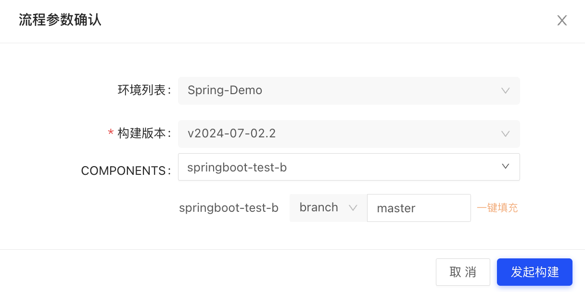
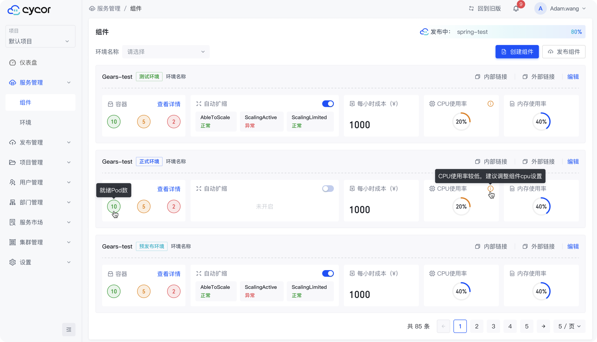

# 五分钟快速使用
### 简介
&nbsp;&nbsp;&nbsp;&nbsp;&nbsp;&nbsp;&nbsp;&nbsp;Cycor是一个智能化多云管理品牌，旗下有多个解决方案组成，将包括Cycor DevOps、Cycor FinOps(建设中)、Cycor Cloud多云管理平台(建设中)组成产品矩阵。而Cycor DevOps是一款专为多云环境设计的云原生持续交付和服务管理产品，具有高效的持续交付能力、高度灵活性等特点。

### 快速开始
访问和登录https://devops.cycor.io

### 创建你的第一个项目
# 创建新项目的条件

## 1. 功能/业务独立性
当一套功能或者业务线可以独立运行、独立部署、独立维护时，可以考虑单独创建一个项目。

**原则：**  
如果业务逻辑高度独立，并且可能单独演进，就可以创建新项目。

---

## 2. 团队/组织边界
如果不同团队负责不同模块，创建独立项目有助于团队独立开发。

**例：**
- 前端团队和后端团队分开开发不同产品，每个产品独立一个项目。
- DevOps/运维上，也便于 CI/CD、权限、监控单独管理。

**原则：**  
团队职责明确且独立时，可以按项目划分。

---

## 3. 技术栈/部署独立性
如果新功能需要不同技术栈或独立部署环境，创建新项目更合理。

**例：**
- 主系统是 Java 后端，新增服务用 Node.js，部署方式不同。
- 微服务架构里，每个服务通常是一个独立项目。

**原则：**  
技术或部署独立，方便运维管理。

---

## 4. 生命周期与版本管理
如果功能模块的生命周期、迭代频率、版本升级独立，分项目更清晰。

**例子：**
- 原系统稳定，但新增模块更新频繁。
- 发布周期不同，单独项目便于独立打包、发布、回滚。

**原则：**  
生命周期不同、版本管理独立时，创建新项目更合理。

---

## 5. 安全/权限隔离
当不同功能需要不同权限、不同安全隔离时，可以新建项目。

**例子：**
- 研发项目 A 对外开放 API，项目 B 内部使用。
- 分项目可以设置不同访问控制策略。
ps：只有项目管理员以及运维人员才可以创建项目
如果不确定是否应该创建新项目，可以咨询
路径：项目管理 ---> 添加项目

### 创建一个服务
路径：服务管理 ---> 组件 ---> 创建组件

* 按照实际情况选择自己的"环境名称";
* 填写自己项目的Git路径；
* 给你的组件起一个易懂的名字；
* 根据实际是需求，选择你的编译环境；
* 点击保存按钮，并返回到上一级菜单；

### 创建一个发布
路径：发布管理 ---> 发布 ---> 版本发布

* 新建或者选择一个版本；
* 选择你刚刚创建的组件；
* 点击“发起构建”按钮；
* 查看发布进度；

### 查看和访问你的服务
路径：服务管理 ---> 组件 ---> 服务列表

* 查看你的服务列表，确认服务状态运行正常；
* 内部链接为服务之间互相访问使用的访问链接，也可以在内网环境中直接进行访问；
* 外部链接为服务对外访问使用的访问链接，可以通过公网访问；