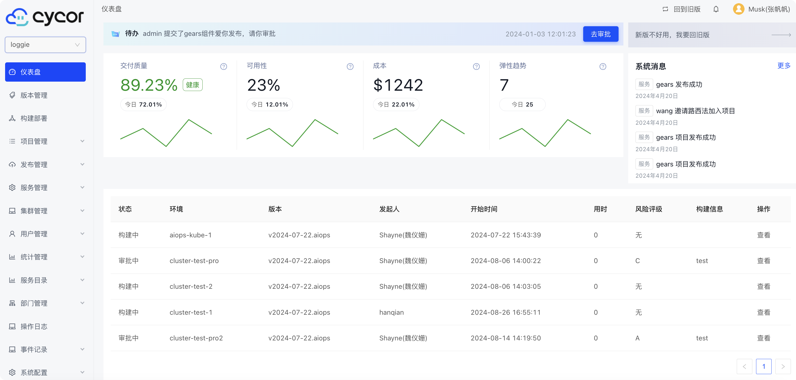
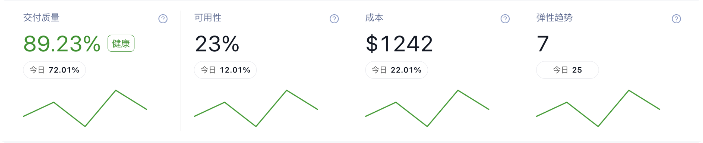
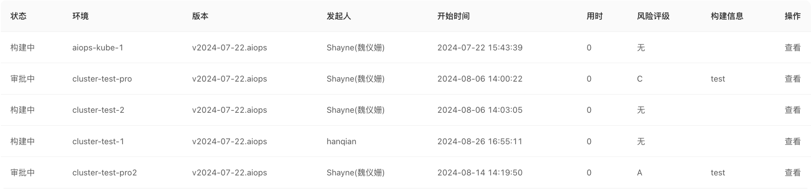

仪表盘显示所选项目下的聚合信息和平台级别的公告信息

## 聚合信息

该模块默认包含了项目中天级别的平均交付质量、可用性、项目IT成本、服务弹性趋势多个维度的信息

**交付质量**：即为构建成功率，它是衡量持续交付过程中的一个关键指标。这个指标反映了每次构建是否成功通过所有自动化测试、质量检查、部署等流程，从而将代码部署到生产环境。构建成功率越高，说明持续交付过程越顺畅，反之亦然。

**可用性**：即服务可用性，它反映了服务在一段时间内是否可用。可用性越高，说明服务越稳定，反之亦然。 

**成本**：即项目容器侧IT成本，它反映了项目在一段时间内所花费的成本。注意，此处的项目IT成本不等于项目成本，项目IT成本是项目在一段时间内所花费的成本，而项目成本是项目在一段时间内所花费的总成本，包括项目IT成本、人力成本、管理成本等。

**弹性趋势**：即服务弹性趋势，它反映了服务在一段时间内是否可用。可用性越高，说明服务越稳定，反之亦然。

## 系统消息

该模块包含了项目中和登陆用户有关的动态事件和信息

## 最近发布

该模块包含了项目组件的发布历史和发布状态，点击查看按钮可以跳转到对应的发布中查看详细信息。