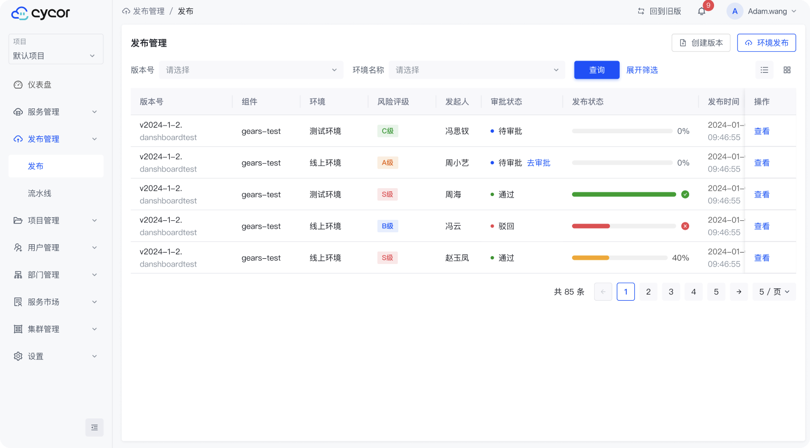
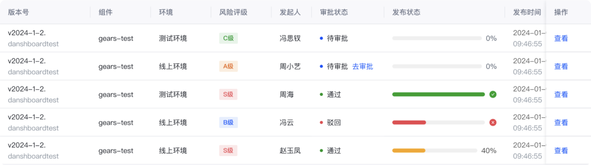
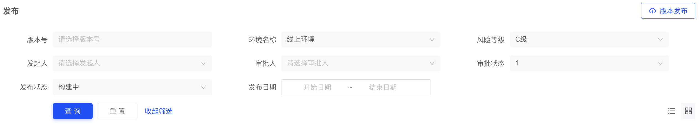
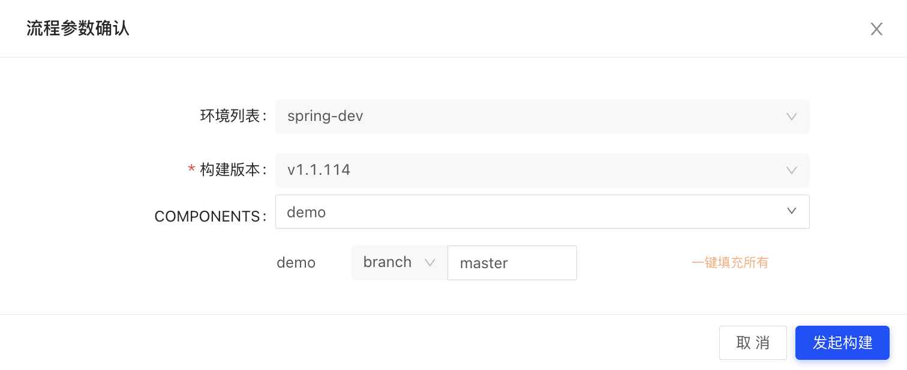

发布管理模块的主要是协调和控制软件从开发环境到生产环境的发布过程。这个模块确保每次发布都是可重复、可靠和可追踪的。它的核心功能包括版本控制、自动化部署、环境管理、发布审批和回滚机制等。

## 列表展示

列表中显示了当前项目下的所有发布记录状态信息，包括版本号、组件、环境、发布类型(风险评级)、发起人、审批状态、发布状态等。

## 风险评级
| 风险评级: A | 风险评级: B | 风险评级: C | 风险评级:  |
| --- | --- | --- | --- |
| 功能开发/数据库结构修改 | 修复/数据修改删除 | 测试/数据库创建表 | 架构/扩容/数据库恢复 |
## 高级筛选

发布管理中的高级筛选功能可以筛选出符合特定条件的发布记录，包括版本号、组件、环境、发布类型、发起人、审批状态、发布状态等。用户可以自定义筛选条件，也可以通过高级筛选条件中的“添加筛选条件”按钮添加新的筛选条件。

## 版本创建

## 环境发布
点击“发布”按钮，弹出发布窗口，选择发布环境，填写对应信息，点击“发布”按钮，即可完成发布操作。
