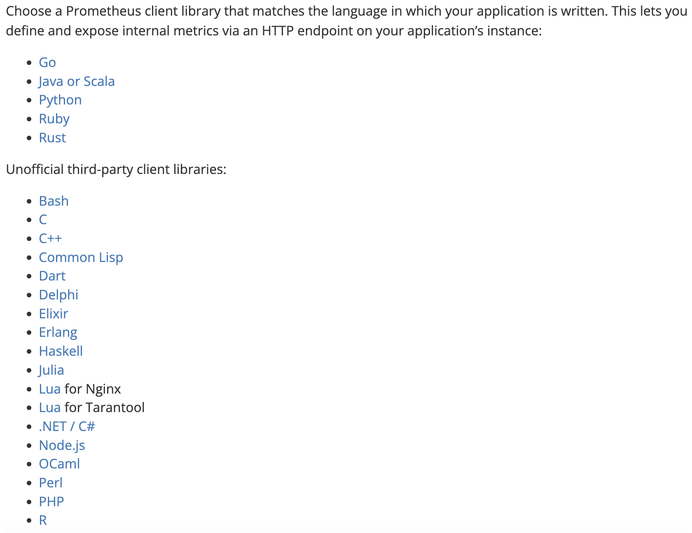
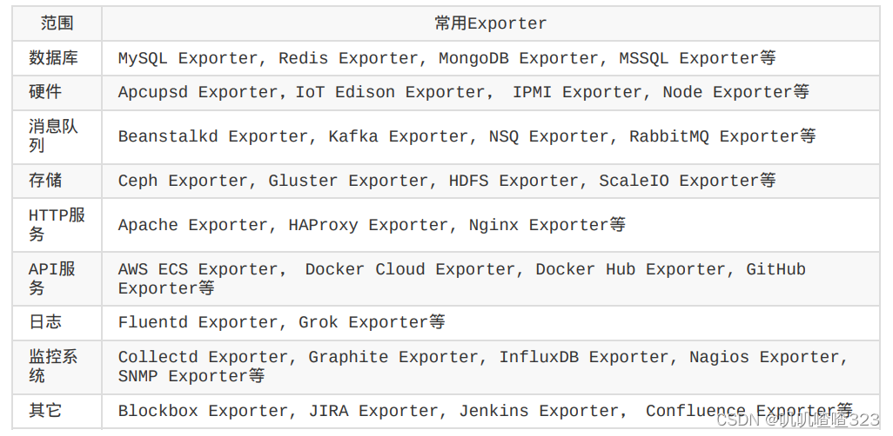
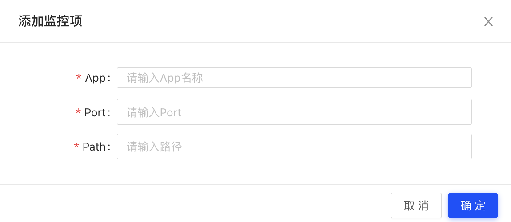
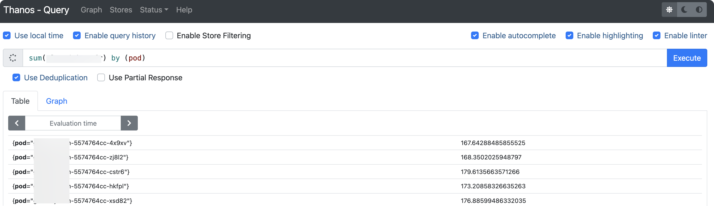
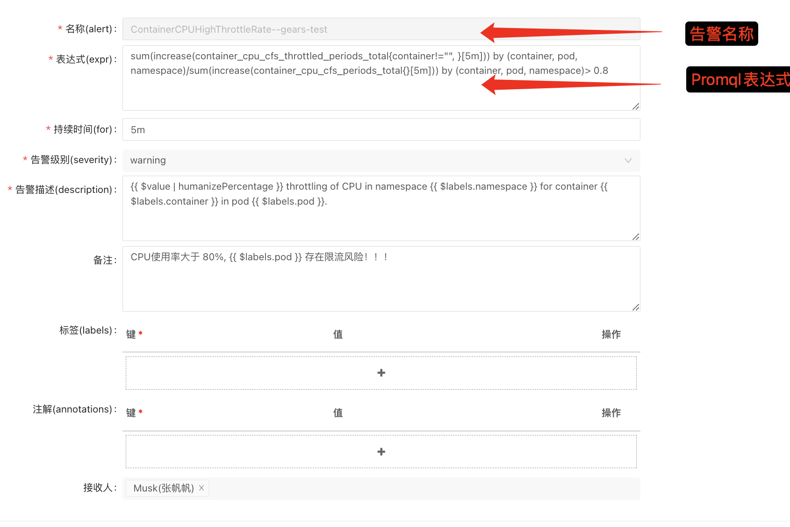
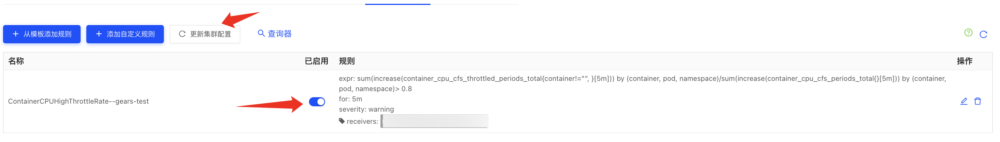
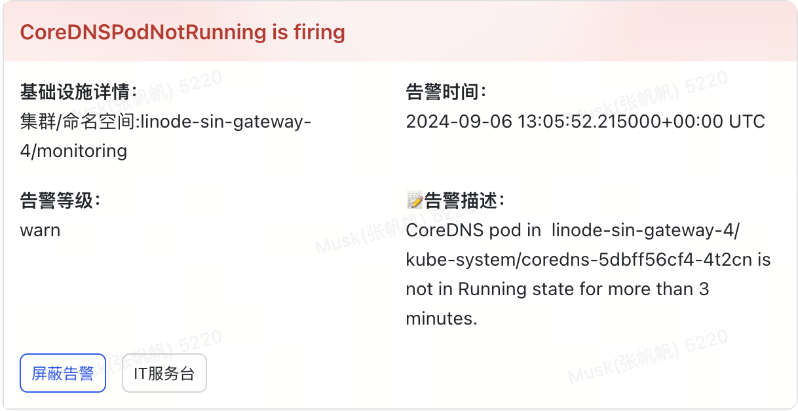
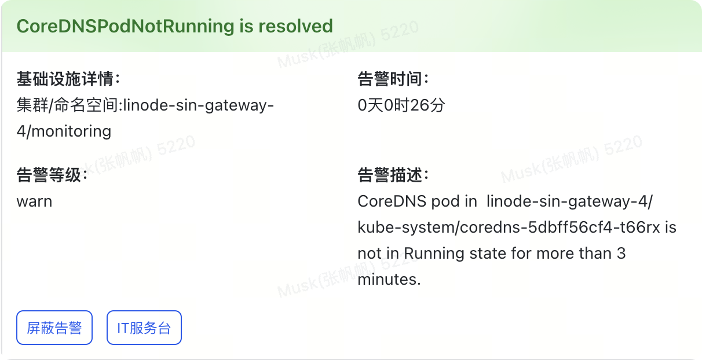

# 可观测性

Cycor DevOps平台支持原生prometheus的数据集成，支持业务自定义指标采集，支持业务自定义指标告警，支持业务自定义指标可视化。

## 监控接入
    在进行服务监控之前，你需要通过 Prometheus 客户端库完成接入。如果没有特殊需求请使用 9090 端口和 /metrics 接口进行数据采集。

    选择与编写应用程序的语言相匹配的 Prometheus [客户端库](https://prometheus.io/docs/instrumenting/clientlibs)。便可以通过应用程序实例上的 HTTP 端点定义和公开内部指标。目前官方支持的客户端库有：Go、Java、Python、Ruby、C++、JavaScript、PHP、Erlang、C#、Swift、Rust等会持续更新中。

    除了 Prometheus提供的SDK，你还可以通过官网提供的[exporter](https://prometheus.io/docs/instrumenting/exporters/)来导出指标数据，该方式适用于第三方应用和中间件、数据库等。

## 数据采集
路径：环境--->配置---业务监控--->增加监控项

APP: 组件名称           Example: nginx
Port: 端口名称          Example: web-8080
Path: 服务路径          Example: /metrics

## 监控查询
路径：环境--->配置---业务监控--->监控查询--->查询器

## 告警配置
路径：环境--->配置---告警配置

**名称:** 告警名称，最终会展示在告警通知中；

**表达式:** Promqlhttps://prometheus.fuckcloudnative.io/di-san-zhang-prometheus/di-4-jie-cha-xun/basics表达式，用于告警触发；

**持续时间:** 告警持续时间，表示告警持续多久后触发告警；

**告警级别:** 取值有warn, error, fatal, warn和error会触发飞书机器人告警，fatal级别的告警会出发飞书加急消息进行电话告警

告警添加完成后请启用告警，并同步配置到集群中即可生效；

## 告警展示
**告警信息**

**恢复信息**

# Log
TODO

# Trace
TODO