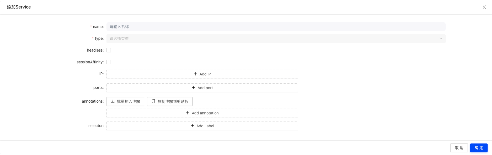

# Service
在Kubernetes中，Service是一个关键组件，主要用于提供对一组运行在集群中的Pod的统一访问。Service的设计使得Pod可以方便地被外部访问或在集群内部进行通信，同时提供负载均衡功能。

Service支持多种类型，确保了其灵活性和广泛的适用场景。例如，ClusterIP类型使Service仅在集群内部可访问，而NodePort和LoadBalancer类型则允许从集群外部访问Service。此外，ExternalName类型提供了一种将Service映射到集群外部服务的方法，通过返回一个DNS名称来实现。

**ClusterIP**  
当Service的类型为ClusterIP时，Kubernetes集群会为Service为分配对应的集群IP，并同时产生一个域名。集群内部可以通过这集群IP或者域名都可以访问整个Service对应的Pod。它为您提供集群内的服务，集群内的其他应用程序可以访问该服务。没有外部访问。  

**Loadblance**  
LoadBalancer 服务是暴露服务到 internet 的标准方式。  
如果你想要直接暴露服务，所有通往你指定的端口的流量都会被转发到对应的服务。它没有过滤条件，没有路由等。这意味着你几乎可以发送任何种类的流量到该服务，像 HTTP，TCP，UDP，Websocket，gRPC 或其它任意种类.  

这个方式的最大缺点是每一个用 LoadBalancer 暴露的服务都会有它自己的 IP 地址，每个用到的 LoadBalancer 都需要付费，这将是非常昂贵的
# 创建Service

* name: 服务名称,如果没有特殊需要，建议和组件名称保持一致；  
* type: 服务类型，支持ClusterIP、NodePort、LoadBalancer；
* headless: 是否为headless类型，如果为true，则为headless类型，否则为ClusterIP类型；  
* sessionAffinity: 会话保持类型，支持None和ClientIP；  
* ports: 服务端口列表，支持TCP和UDP协议；  
* annotations: 服务注解列表；  
* selector: 服务选择器，用于选择目标Pod；  

# 查看Service
TODO