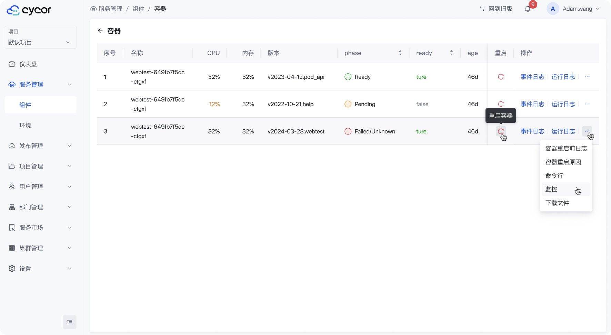

服务管理页面可以查看当前项目下的所有服务信息，包括服务名称、服务性能指标、服务状态等。

## 容器状态
* 绿色 Ready: 服务正常运行,Pod已准备好接受服务;
* 黄色 Pending/Running: Pod正在创建中/或正在运行中,暂未通过健康检查；
* 红色 Failed: Pod创建失败,请检查服务配置;

## 自动扩缩
* AbleToScale:  HPA依赖的所有数据和服务一切正常，可以进行扩缩操作；
* ScalingActive: HPA当前正在进行扩展或缩减操作,主动调整Pod的副本数量;
* ScalingLimited: HPA当前正在扩展或缩减操作,但无法达到期望的副本数量,因为存在资源限制;

## 性能指标
* CPU: CPU使用率，计算公式为容器的实际CPU使用量/容器CPU限制（Limit）;
* Memory: 内存使用率，计算公式为容器的实际内存使用量/容器内存限制（Limit）;

##  容器列表

容器列表可以查看当前服务下的所有容器信息，包括容器名称、容器状态、容器IP、容器端口、容器健康检查状态等。

在容器列表中，可以点击容器名称，进入容器详情页面，查看容器日志、容器配置、容器健康检查、容器事件等详细信息。