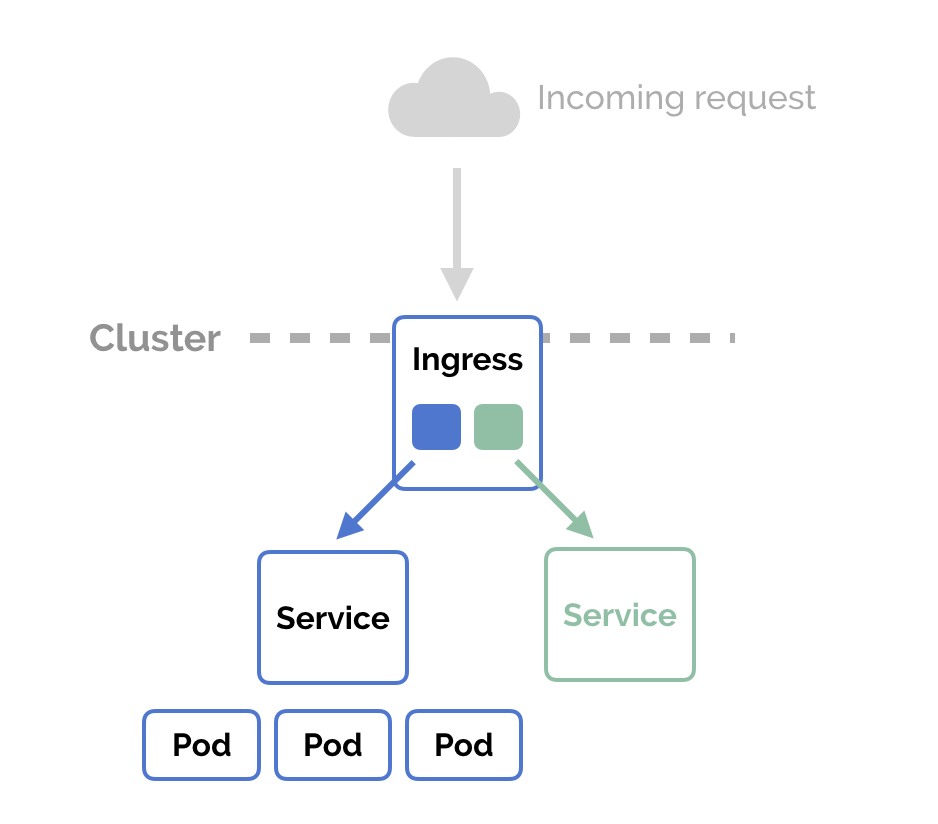
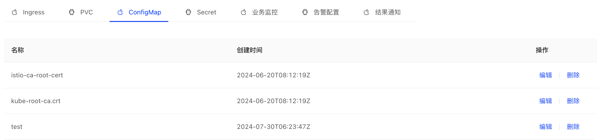
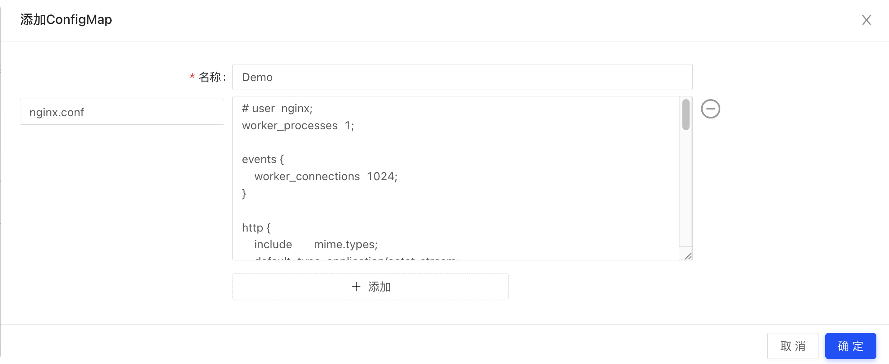
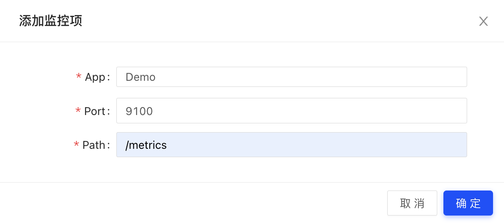
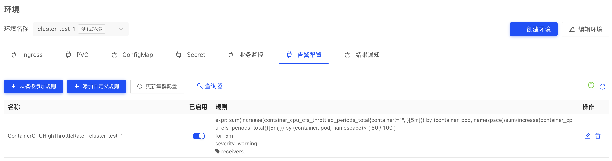
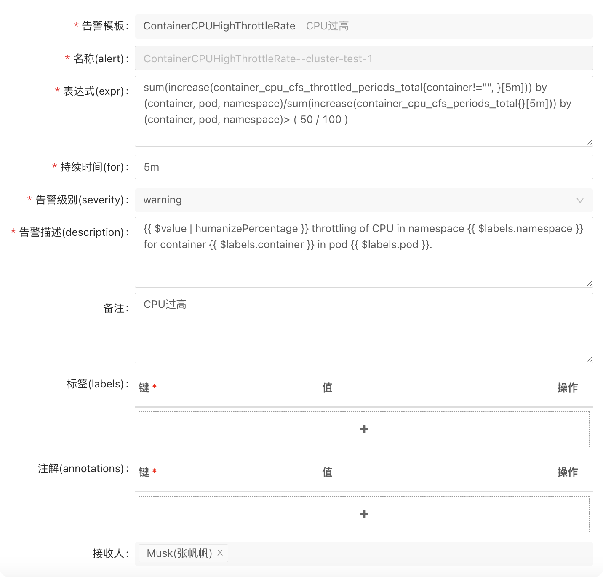

## Ingress
Ingress 是从 Kubernetes 集群外部访问集群内部服务的入口，是将 Kubernetes 集群内部服务暴露到外界的几种方式之一（另外还有Service中的LoadBanlance和nodeporter类型等）。

Ingress 公开了从集群外部到集群内服务的 HTTP 和 HTTPS 路由。 流量路由由 Ingress 资源上定义的规则控制。

下面是一个将所有流量都发送到同一 Service 的简单 Ingress 示例：


Ingress 资源本身不直接提供负载均衡，而是通过 Service 提供负载均衡。 Ingress 只是提供了一种路由规则，而 Service 负责具体的流量转发。


## PVC

PVC (PersistentVolumeClaim)
   持久卷（PersistentVolume，PV）是集群中的一块存储，持久卷申领（PersistentVolumeClaim，PVC）表达的是用户对存储的请求。

 
PVC配置操作

* 名称：自定义;
* 空间大小：根据要存储数据的大小设置;
* 访问方式：根据实际需求选择，需要注意ReadWriteMany只能使用文件存储类型的StorageClass；
* 存储类(StorageClass):详见下文StorgeClass；

访问模式

* ReadWriteMany 多路读写，卷能被集群多个节点挂载并读写
* ReadWriteOnce 单路读写，卷只能被单一集群节点挂载读写
* ReadOnlyMany 多路只读，卷能被多个集群节点挂载且只能读。

  StorageClass 为管理员提供了描述存储 “类” 的方法。 不同的类型可能会映射到不同的服务质量等级或备份策略，或是由集群管理员制定的任意策略。 Kubernetes 本身并不清楚各种类代表的什么。这个类的概念在其他存储系统中有时被称为 “配置文件”。

## ConfigMap

    可以使用 ConfigMap 将配置数据和应用程序代码分开，ConfigMap 可以以只读文件的方式挂载到指定目录供应用程序读取。

添加一个新的ConfigMap：


    ConfigMap 并不提供保密或者加密功能。 如果你想存储 的数据是机密的，请使用 Secret。

## Secret
    Secret可以包含少量敏感信息例如密码、令牌或密钥的对象。 这样的信息可能会被放在 Pod 规约中或者镜像中。 使用 Secret 意味着你不需要在应用程序代码中包含机密数据。
    由于创建 Secret 可以独立于使用它们的 Pod， 因此在创建、查看和编辑 Pod 的工作流程中暴露 Secret（及其数据）的风险较小。 Kubernetes 和在集群中运行的应用程序也可以对 Secret 采取额外的预防措施， 例如避免将机密数据写入非易失性存储。
    每个 Secret 的尺寸最多为 1MiB。施加这一限制是为了避免用户创建非常大的 Secret， 进而导致 API 服务器和 kubelet 内存耗尽。不过创建很多小的 Secret 也可能耗尽内存。

## 监控

主要用于业务埋点的监控项。

自定义监控
入口：构建部署 –> 功能模块 –> 业务监控
添加监控对象


监控查询
TODO
各语言Prometheus接入方法
https://prometheus.io/docs/instrumenting/clientlibs/

## 告警
    Cycor DevOps平台提供一些告警模板来配置告警功能，配置告警可帮助你及时发现集群问题并进行处理。可以毫不夸张的说集群告警在信息管理中是非常重要的一部分，那么，本文为您介绍通过控制台配置告警的操作。
    目前我们定义了60多个通用性的告警规则模板可供大家参考使用，内容覆盖了容器的一般故障告警，主机的一般故障告警，集群的故障告警等等，并且仍在持续不断的更新和完善中

常用告警配置信息示例：
* ContainerMemoryUsage 容器Memory使用率超过 80%
* KubenetesStatefulDown 至少有一个 StatefulSet 副本状态不正常
* KubenetesHpaMaxedOut 容器扩缩容功能无法缩容或HPA已达HPA扩容最大值
* HostNetworkInterfaceStatured 主机网络接口负载高

已配置好的告警示例：

告警配置

```
告警模板： 多个预定义告警模板，适用于大部分故障场景。
表达式： 告警表达式，遵循promql语法，可自由配置。
持续时间： 告警项灵敏度配置，代表告警持续多久后发给所配置接收人。
告警描述： 字面意思。
labels：和其它系統lable沒啥区別。
注解： 不用关注
```

注：告警添加完成后需点击“更新集群配置”应用告警规则。

添加配置的两种方法：
方法一:从模板中添加 (常用)


方法二：自定义添加
所需信息自行填写


接收人信息：
会使用飞书邮箱进行发送相关告警信息。